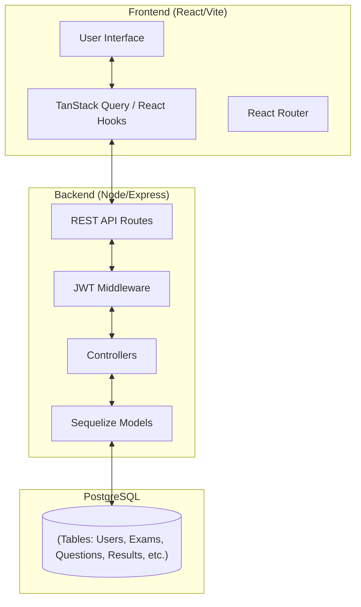

# 📝 Online Examination System (Exam-OS)

[**Live Demo**](https://exam-os-fawn.vercel.app/login)

A full-stack web application for managing online examinations with role-based access for **Admins**, **Teachers**, and **Students**.

## ✨ Features

### Admin
- Dashboard with system-wide statistics
- Approve/reject teacher and student registrations
- Manage all users and exams

### Teacher
- Create and manage exams with multiple question types
- Add questions with rich text editor
- Assign students to exams
- View exam results and analytics

### Student
- Browse and take assigned exams
- Real-time exam timer with server-side validation
- Autosave answers during exam
- Tab-switch detection (proctoring)
- View results and performance history

## 🛠️ Tech Stack

| Layer      | Technology                                      |
|------------|--------------------------------------------------|
| Frontend   | React 19, Vite, React Router, TanStack Query     |
| Backend    | Node.js, Express 5                                |
| Database   | PostgreSQL with Sequelize ORM                     |
| Auth       | JWT (JSON Web Tokens)                             |
| UI         | Lucide React Icons, Recharts, React Quill         |
| Styling    | Vanilla CSS                                       |

## 🗺️ System Architecture



## 📁 Project Structure

```
Exam-OS/
├── backend/
│   ├── config/         # Database configuration
│   ├── controllers/    # Route handlers
│   ├── db/             # Database connection
│   ├── middleware/      # Auth & validation middleware
│   ├── models/         # Sequelize models
│   ├── routes/         # API routes
│   ├── utils/          # Utility functions
│   ├── validation/     # Zod validation schemas
│   ├── server.js       # Entry point
│   └── package.json
├── frontend/
│   ├── public/
│   ├── src/
│   │   ├── components/ # Reusable UI components
│   │   ├── hooks/      # Custom React hooks
│   │   ├── pages/      # Page components (admin, teacher, student)
│   │   ├── services/   # API service layer
│   │   ├── App.jsx     # Main app with routing
│   │   └── main.jsx    # Entry point
│   ├── index.html
│   ├── vite.config.js
│   └── package.json
├── docker-compose.yml  # PostgreSQL container setup
├── .gitignore
└── README.md
```

## 🚀 Getting Started

### Prerequisites
- **Node.js** v18+
- **PostgreSQL** (or Docker)

### 1. Clone the Repository
```bash
git clone https://github.com/Vaenvoice/Exam-OS.git
cd Exam-OS
```

### 2. Set Up the Database

**Option A: Using Docker (recommended)**
```bash
docker-compose up -d
```

**Option B: Manual PostgreSQL**
- Create a database named `exam_db`
- Create a user with appropriate permissions

### 3. Configure Environment Variables
```bash
cp backend/.env.example backend/.env
# Edit backend/.env with your database credentials
```

### 4. Install Dependencies
```bash
# Backend
cd backend
npm install

# Frontend
cd ../frontend
npm install --legacy-peer-deps
```

### 5. Start the Application
```bash
# Start backend (from backend/)
npm start        # Production
npm run dev      # Development (with nodemon)

# Start frontend (from frontend/)
npm run dev
```

The frontend runs on `http://localhost:5173` and the backend API on `http://localhost:5000`.

## 🔑 Default Admin Setup

Register the first user as an **Admin** through the registration page. Subsequent users (Teachers/Students) require admin approval.

## 📡 API Endpoints

| Method | Endpoint                    | Description              |
|--------|-----------------------------|--------------------------|
| POST   | `/api/auth/register`        | Register new user        |
| POST   | `/api/auth/login`           | User login               |
| GET    | `/api/users`                | List users (admin)       |
| PATCH  | `/api/users/:id/approve`    | Approve user (admin)     |
| GET    | `/api/exams`                | List exams               |
| POST   | `/api/exams`                | Create exam              |
| GET    | `/api/exams/:id/questions`  | Get exam questions       |
| POST   | `/api/exams/:id/submit`     | Submit exam              |
| GET    | `/api/results`              | Get results              |

## 📄 License

ISC
